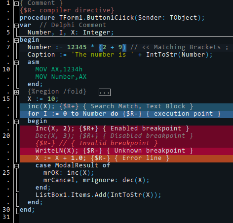

# Kurwish_Dark-Lazarus_color_scheme
A dark color scheme for Lazarus IDE, clean, neat and featuring subdued colors.

How to use:
1. Create a folder {LAZARUS_CONF_DIR}\userschemes .
2. Copy Kurwish_Dark.xml into this folder.
3. Open Lazarus options (Tools -> Options -> Editor -> Display -> Colors) and select "Kurwish_Dark" color scheme.

{LAZARUS_CONF_DIR} is the folder where Lazarus keeps its settings, by default:
- ~/.lazarus under Linux, macOS
- C:\Users\<User name>\AppData\Local\lazarus\ under Windows
